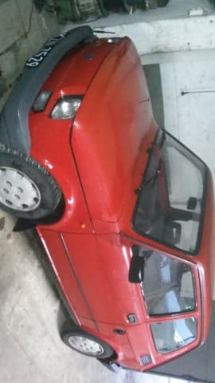
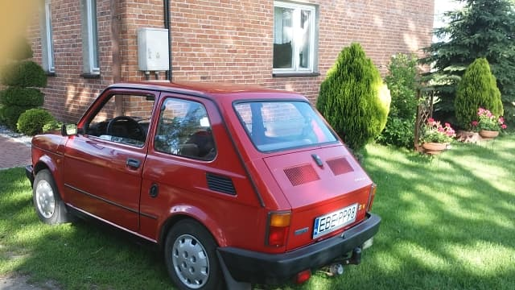
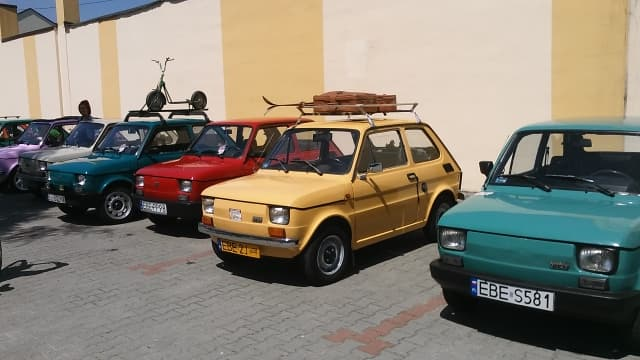

# zad
<!DOCTYPE>
<html>
</head>
<body>

<h1>FIAT 126p "MALUCH" 1998r</h1>

 

<b><h2>Fiat 126p – samochód osobowy klasy aut najmniejszych, konstrukcji włoskiego producenta Fiat, produkowany w latach 1972–2000. Produkowany był przez Fiata oraz na licencji przez polską Fabrykę Samochodów Małolitrażowych (od 1992 część koncernu Fiat jako Fiat Auto Poland) jako Polski Fiat 126p (we Włoszech do 1980, w Polsce w okresie od 6 czerwca 1973 do 22 września 2000).</h2></b>

	<ol type="1">
	<li>Fiat 126/126p został wyprodukowany łącznie w 4 671 586 egzemplarzach z czego aż 3 352 912 sztuk powstało w polskich zakładach w Tychach i Bielsku-Białej. Fiat 126p stał się samochodem, który zmotoryzował Polaków.</li> 
	 
	</ul>
<li>Dwudrzwiowe nadwozie mieściło cztery osoby. We wnętrzu, nawet na okres, kiedy rozpoczęła się produkcja tego Fiata, było niezwykle ciasno i pasażerowie nie mogli liczyć na żaden komfort. Fotele były małe (choć całkiem wygodne), a ilość miejsca nad głowami i na nogi znikoma. Pasażerowie narzekali na niezbyt dobrą wentylację kabiny oraz słabe ogrzewanie, ale do zalet tego samochodu zaliczali doskonałą widoczność w każdym kierunku oraz możliwość zaparkowania niemal w każdym miejscu.</li>
 
<li>Choć auto często wykorzystywano do dłuższych podróży, nie było ono stworzone do tego celu. Miało mały bagażnik umieszczony z przodu, w którym dodatkowo znajdowało się koło zapasowe.</li>
 
<li>Następca modelu 500 początkowo wyposażany był w 2-cylindrowy, chłodzony powietrzem silnik o objętości skokowej 0,6 l i mocy maksymalnej 24 KM. W kolejnych latach w 126p montowano również 2-cylindrową jednostkę, ale o objętości skokowej powiększonej do 0,65 l. Motor miał o 1 KM więcej niż poprzednik. Jednostkę napędową zawsze montowano z tyłu, a napęd przenosiła na tylną oś 4-biegowa skrzynia manualna. Dostęp do silnika możliwy był po uchyleniu jego pokrywy z tyłu.</li>
 
	
</li>
<li>Niewielkie motory sprawiały, że Fiat 126p - choć lekki - był powolny i ospały. Według różnych danych samochód potrzebował od 30 do 50 s na rozpędzeni się do 100 km/h (dane katalogowe z 1991 roku mówią o 50 s) i osiągał prędkość 120 km/h (są osoby, które twierdzą, że rozpędziły Malucha do większej prędkości). Małe silniki, choć awaryjne, były tanie w eksploatacji i naprawie. Części do tych jednostek napędowych wytwarzało wiele firm, a koszt ich zakupu był niski. Do tego samochód ten potrafił naprawić każdy mechanik.
</li>
 
	<li>Pod koniec produkcji Fiata 126p, w 1997 roku, oficjalnie nadano mu nazwę Maluch, którą od wielu lat stosowali nabywcy tego samochodu. Gdy w 1991 roku do produkcji weszło Cinquecento, wieszczono rychły koniec Fiata 126p. Jednak kolejne lata pokazały, że samochód ten jest chętnie nabywany, mimo że są od niego auta nowocześniejsze. Wytwarzanie Fiata 126p zakończono dopiero w roku 2000.</li>
	  
	
	<li>W Polsce jest organizowane dużo zlotów fanów polskiego malucha.</li>
	
	
	
	

<h3>ZLOT</h3>

	
	
	
	
	
	
	
	
	
	
	PS. Na zdjeciach Maluch mojego taty :)
	
	</ol>
	</ol>

</body>
</html>
	
